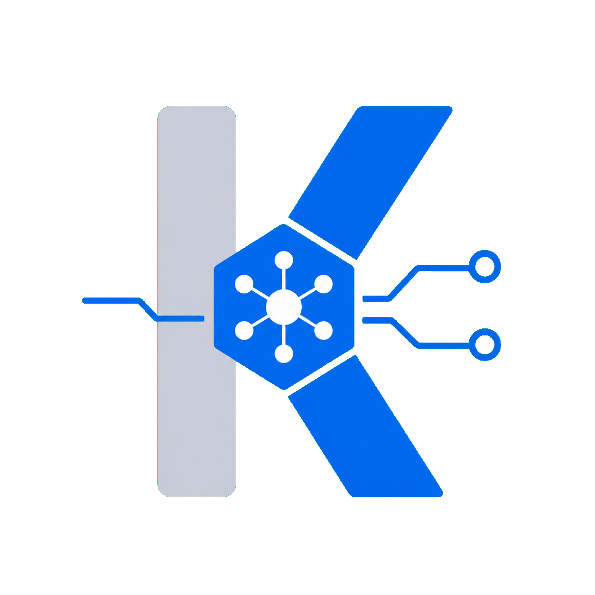

# Kemo Provider Gateway

<p align="center">
  
</p>

<p align="center">
  <a href="README.md">简体中文</a> · <strong>English</strong>
</p>

<p align="center">
  <strong>A unified multi-provider model gateway for agents and knowledge graphs.</strong>
</p>

<p align="center">
  Normalize vendor-specific requests, streaming events, tool calls, capabilities, errors,<br>
  and token accounting into the stable Kemo Provider Protocol.
</p>

<p align="center">
  <a href="https://github.com/kesepain-KE/kemo-adapter-api"></a>
  
  
  <a href="LICENSE"></a>
</p>

---

## Every vendor has its own protocol. That is the problem.

Each model vendor — request format, streaming events, tool calls, capability declarations, error semantics, token accounting. Every layer means another round of adaptation.

When an agent runtime talks to vendors directly, every new provider requires rewriting the same protocol translation layer. Worse, authentication, key management, and reachability probes are scattered across the codebase, making maintenance harder over time.

Kemo Gateway is built for this.

It is not another model aggregation interface. It is a translation layer: the agent expresses itself through one stable protocol, and the gateway translates that into each vendor's native language. When the vendor responds, the gateway translates back.

Every vendor-specific behavior lives inside a dedicated `providers/<provider_id>/` package. The core code contains no vendor-name branches.

```text
kemo-agent / kemo-graph / other Kemo clients
                       │
                       ▼
              Kemo Provider Protocol
                       │
                       ▼
        Provider Registry + Gateway Core
                       │
          ┌────────────┼────────────┐
          ▼            ▼            ▼
     Provider A   Provider B   Provider C
```

---

## What it offers

| Scenario | What the gateway brings |
|----------|------------------------|
| Multi-vendor unification | One stable Kemo protocol on top; vendor differences are isolated in dedicated Provider Packages |
| Model discovery and capability query | Returns the models a key can actually invoke, with real capability declarations |
| Embedding and Rerank | Dedicated vectorization and reranking contracts for knowledge graph scenarios |
| Per-key access control | Every gateway key can allow all, deny all, or allow only selected models |
| Hot-reload at runtime | Provider settings, gateway keys, system prompts, and provider/model toggles take effect without restart |
| Provider-owned probes | Reachability testing is owned by each Provider; the core consumes a normalized result only |
| Web console | Manage providers, models, keys, statistics, call logs, versions, and restarts from a browser |
| Agent status awareness | `GET /status` uses an independent `STATUS_TOKEN` for read-only gateway snapshots |

These are not isolated features. They share one goal: let the agent focus on understanding the user, without caring which vendor is behind the request.

---

## Public API

The public surface contains model, retrieval, and read-only status APIs. Administration APIs are private.

| Method and path | Purpose |
| --- | --- |
| `GET /model/models` | List the Kemo models available to the current key |
| `GET /model/models/{model}/capabilities` | Read the declared capabilities of one model |
| `GET /v1/models` | Model-discovery compatibility endpoint |
| `POST /model/responses` | Create a non-streaming or SSE LLM response |
| `GET /model/responses/{response_id}` | Retrieve a response |
| `POST /model/responses/{response_id}/cancel` | Cancel a response |
| `POST /model/embeddings` | Generate query or document embeddings in batches |
| `POST /model/rerank` | Rerank candidate documents |
| `GET /status` | Read a gateway status snapshot for an external agent |

`GET /v1/models` is a discovery-only compatibility endpoint. The gateway does not expose `/v1/chat/completions` or `/chat/completions`; inference must use `POST /model/responses`.

See [api.md](api.md) for request fields, authentication, SSE, idempotency, Embedding, Rerank, and error contracts.

### Public model names

Every public model name follows the rule `<provider_id>-<vendor_model_name>`. For example, `deepseek-deepseek-v4-flash`. The registry stores exact ownership; the gateway does not guess ownership by splitting on arbitrary hyphens and does not accept the legacy `provider_id/model` format.

---

## Quick start

### Requirements

- Python 3.11 or newer
- Node.js
- pnpm

### 1. Initialize the project

```powershell
python setup.py
```

Running without arguments performs a complete deployment: it installs Python dependencies, rebuilds the
Web console, and creates `.env` from `.env.example` only when `.env` does not already exist. Use
`python setup.py --check` to validate an existing deployment without installing or building anything.

### 2. Configure a gateway key

For a normal deployment, create the hot-reloadable key file from the example:

```powershell
Copy-Item api/keys.json.example api/keys.json
```

Replace the sample token and configure `scopes` and `allowed_models`. A `null` allowlist permits every model, an empty list denies every model, and a non-empty list is a strict model allowlist. The real `api/keys.json` is ignored by Git.

For initial bootstrap or emergency access, a single `GATEWAY_API_KEY` may be placed in `.env` instead. Environment variables are read only at process startup and require a restart after changes.

### 3. Install a Provider

Real deployment-specific `providers/*` packages are not committed by default. Create a local provider from `template/provider/`, or let an agent follow [agent_control.md](agent_control.md) and [ADD_DIY/README.md](ADD_DIY/README.md) to build and verify one.

Adding a Provider directory or changing Python, manifests, or dependencies requires a restart. Existing Provider `config.json` and `secrets.json` files can be hot-reloaded.

### 4. Start the gateway

```powershell
python start_web.py
```

Default endpoints:

- Web console: `http://127.0.0.1:7531/admin`
- Kemo model catalog: `http://127.0.0.1:7531/model/models`
- OpenAPI: `http://127.0.0.1:7531/docs`

`HOST`, `PORT`, `LOG_LEVEL`, and the externally advertised `GATEWAY_BASE_URL` are loaded from `.env`. When the gateway is published behind a reverse proxy or domain, set `GATEWAY_BASE_URL` to that external address. It is displayed and copied by the console; it does not change the listener or route layout.

---

## Authentication boundaries

The gateway deliberately uses three independent credential classes:

| Credential | Purpose | Configuration |
| --- | --- | --- |
| Gateway invocation key | Models, Embedding, Rerank | `api/keys.json` or startup settings |
| Web credentials | `/admin` and protected management APIs | `WEB_TOKEN`, username, and password in `.env` |
| Status token | Read-only `GET /status` access | `STATUS_TOKEN` in `.env` |

When both a Web token and username/password are configured, the token check runs first and the password check runs second. Both session stages expire after two hours. If all three Web credential fields are empty, the console enters passwordless owner mode; always configure management credentials on an untrusted network.

`STATUS_TOKEN` must not match a model invocation key or Web token. The status API never returns raw gateway keys, Provider secrets, request bodies, raw vendor responses, or stack traces.

---

## Connect the kemo-agent status extension

kemo-agent `v0.6.0` includes `global_expand/kemo_gateway_status/`. The extension is inactive by default. It reads `GET /status` with a dedicated status token only after explicit user authorization, and it never calls restart, key-management, or Provider-configuration administration APIs.

### 1. Configure a status token on the gateway

Add a new dedicated token to the gateway `.env`:

```dotenv
STATUS_TOKEN=replace-with-a-dedicated-random-token
```

Environment variables are read at startup, so restart the gateway after changing this value. It must not match `WEB_TOKEN`, `GATEWAY_API_KEY`, or any model invocation key in `api/keys.json`; otherwise `/status` refuses to start.

### 2. Ask the main agent to activate the extension

Explicitly ask kemo-agent to activate the Kemo gateway status extension and provide the gateway root URL and status token. The main agent performs the equivalent structured call:

```text
expand_call(
  scope="global",
  module="kemo_gateway_status",
  command="activate",
  params={
    "base_url": "http://127.0.0.1:7531",
    "status_token": "<dedicated STATUS_TOKEN>"
  }
)
```

The extension validates the endpoint and response contract before it saves local configuration or enables prompt injection. It generates a concise status summary, a strict allow-list JSON snapshot, and a `1600×900` PNG chart covering runtime phase, version, Providers and models, success rate, latency, cache hit rate, and token usage.

When the gateway is published behind a reverse proxy, FRP tunnel, or domain, `base_url` must be the exact external root URL reachable from kemo-agent. The status client refuses HTTP redirects so that the token cannot be forwarded to a host other than the configured origin.

### 3. Refresh, inspect, or deactivate

- `refresh` collects a new snapshot immediately and may target a statistics date;
- `configuration_status` reads local activation state without a network request or token disclosure;
- `deactivate` removes the local kemo-agent credentials, snapshots, and chart without stopping or modifying the gateway.

See [api.md](api.md#智能体全局感知接口) for the complete status fields and error semantics.

---

## Hot reload versus restart

| Change | Restart required |
| --- | --- |
| `api/runtime.json` or `api/keys.json` | No |
| Provider `config.json` or `secrets.json` | No |
| Highest-priority system prompt or provider/model switches | No |
| `.env` variables | Yes |
| Python, Provider manifests, dependencies, or protocol models | Yes |
| Adding or removing a Provider directory | Yes |
| Web front-end source or build output | Yes |

Graceful restart:

```powershell
python restart.py --reason "update configuration"
python restart.py --status
```

The restart module drains in-flight requests before restarting. The web console also provides confirmation, progress feedback, and status polling.

---

## Provider development

The only authoritative template is `template/provider/`. A Provider must at minimum implement or declare:

- **Contract** — abstract methods in `ProviderPackage` (`core/provider_contract.py`)
- **Protocol** — `protocol.py` maps KemoRequest ↔ vendor request
- **Streaming** — `streaming.py` translates vendor SSE events into envelope-free `ProviderEvent` values
- **Capabilities** — `capabilities.py` declares supported tasks, modalities, tools, and reasoning levels
- **Probing** — `probe.py` implements connectivity and model reachability probes
- **Contract verification** — `test_contract.py` contains test cases that validate the implementation against the ProviderPackage interface

There is no second authoritative reference beyond `template/provider/`. After implementing a provider package, run the contract tests before putting it into service.

See [ADD_DIY/provider-package.md](ADD_DIY/provider-package.md) for the creation workflow.

---

## A gateway is more than connectors

Kemo Gateway does not try to be an all-encompassing platform.

It aims to be a stable protocol bridge:

- Adding a new vendor does not require changing core code;
- Switching models does not require changing the caller's code;
- When a vendor updates its API, only that Provider Package needs updating;
- Keys and configuration can change at runtime without interrupting service.

The agent on top can keep talking through the same protocol. The vendor differences, upgrades, and swaps — they stay behind this translation layer.
